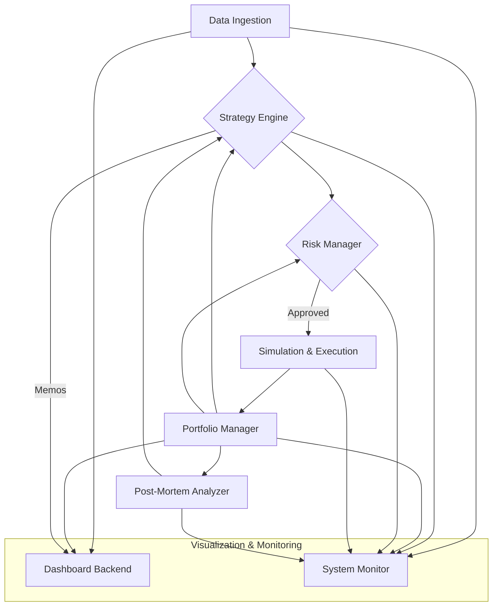

# Prediction Market Fund - System Architecture

This document outlines the modular architecture of the autonomous prediction market trading agent. The system is designed with a strict separation of concerns to ensure maintainability, testability, and scalability, in accordance with assertion `ARCH-001`.

## Core Principles

- **Modularity**: Each component has a single, well-defined responsibility.
- **Clear Interfaces**: Components communicate through clean, typed APIs.
- **Unidirectional Data Flow**: Data flows in a predictable path, primarily from data sources, through strategy and risk, to execution.
- **Dependency Injection**: Implementations are decoupled from their interfaces, allowing for easy testing and mocking.

## System Components

The system is composed of the following primary services:

### 1. Data Ingestion Service
- **Responsibility**: Gathers, cleans, and standardizes data from multiple independent sources to inform trading decisions.
- **Assertions Met**: `DATA-001`
- **Inputs**: List of markets to monitor, list of data source connectors (e.g., News APIs, on-chain data, polling aggregators).
- **Outputs**: Standardized `MarketData` objects, which include market probabilities, timestamps, and source-verified information.
- **Interfaces With**: Strategy Engine, Dashboard Backend.

### 2. Portfolio Manager
- **Responsibility**: Acts as the single source of truth for the fund's state, including Net Asset Value (NAV), active positions, and historical PnL.
- **Assertions Met**: `VIS-001` (data provider), `RISK-001` (state provider)
- **Inputs**: Trade execution records from the Execution Service.
- **Outputs**: Real-time `PortfolioState` object.
- **Interfaces With**: Risk Manager, Strategy Engine, Dashboard Backend, Post-Mortem Analyzer.

### 3. Risk Manager
- **Responsibility**: Enforces all capital preservation and risk management rules *before* a trade is executed.
- **Assertions Met**: `RISK-001`, `AGENT-001` (Circuit Breakers)
- **Inputs**: A proposed `TradeOrder` from the Strategy Engine, current `PortfolioState`.
- **Outputs**: An approved or rejected trade decision.
- **Interfaces With**: Strategy Engine.

### 4. Strategy Engine
- **Responsibility**: The core decision-making brain. It analyzes `MarketData`, calculates Expected Value (EV), determines position size, and generates Investment Memos.
- **Assertions Met**: `STRAT-001`, `EXP-001`, `BENCH-001`
- **Inputs**: `MarketData`, `PortfolioState`.
- **Outputs**: A `TradeOrder` to be sent to the Risk Manager. A `BenchmarkingSignal` for the naive baseline strategy.
- **Interfaces With**: Data Ingestion Service, Portfolio Manager, Risk Manager.

### 5. Simulation & Execution Service
- **Responsibility**: Simulates and executes paper trades. It models real-world conditions like fees, slippage, and liquidity. For this project, it is purely a simulation.
- **Assertions Met**: `SIM-001`
- **Inputs**: An approved `TradeOrder` from the Risk Manager.
- **Outputs**: A `TradeResult` record (confirming execution price, size, and fees).
- **Interfaces With**: Risk Manager, Portfolio Manager.

### 6. Post-Mortem Analyzer
- **Responsibility**: Analyzes the performance of closed positions to facilitate continuous learning.
- **Assertions Met**: `LEARN-001`
- **Inputs**: `TradeResult` and its associated `InvestmentMemo`, final market resolution data.
- **Outputs**: A `PerformanceReport` which can be used to update the Strategy Engine's models.
- **Interfaces With**: Portfolio Manager.

### 7. Dashboard Backend
- **Responsibility**: Provides a real-time API for the visualization front-end.
- **Assertions Met**: `VIS-001`
- **Inputs**: Data from Portfolio Manager, Data Ingestion Service (for watchlists), Strategy Engine (for Investment Memos).
- **Outputs**: JSON API endpoints for consumption by a web dashboard.
- **Interfaces With**: All other services (read-only).

### 8. System Monitor & Operations
- **Responsibility**: Handles system-wide concerns like logging, alerting, and escalation to human supervisors.
- **Assertions Met**: `OPS-001`, `AGENT-001`, `COST-001`
- **Inputs**: Logs and health checks from all services.
- **Outputs**: Alerts to human supervisors.
- **Interfaces With**: All other services.

## Data Flow Diagram (Simplified)

